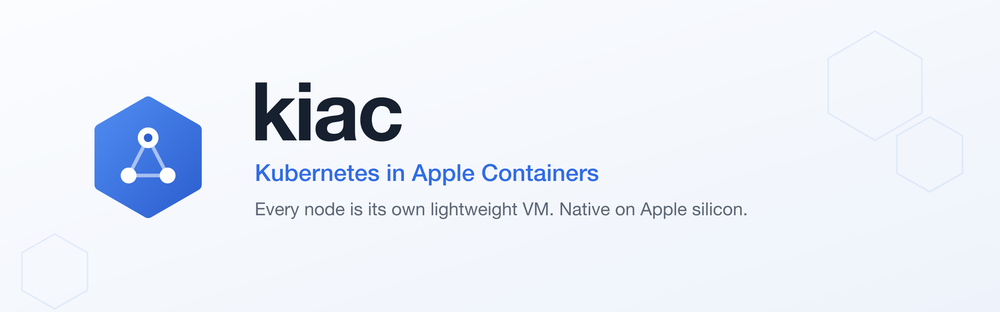
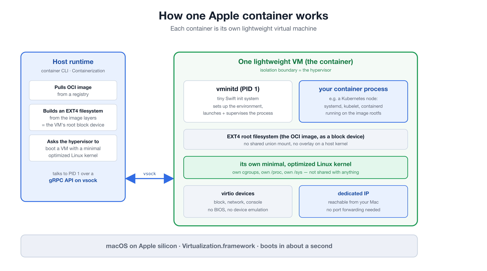
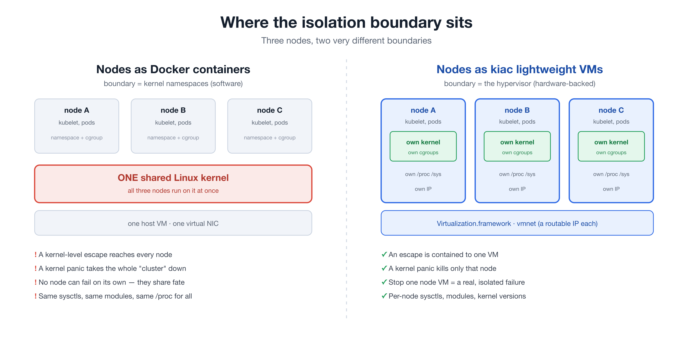
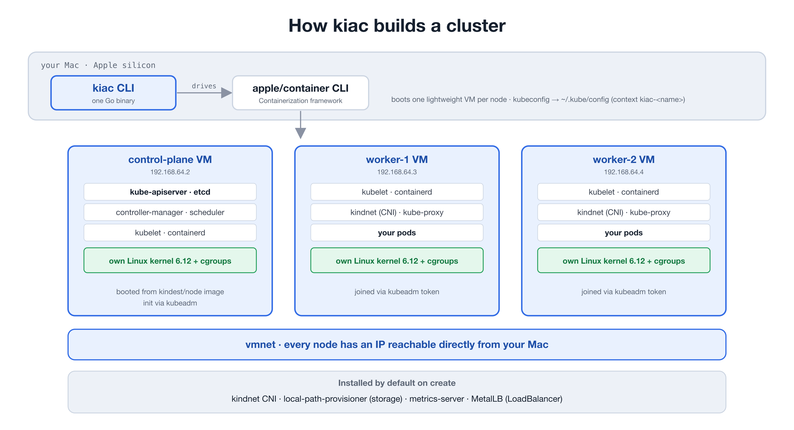

<p align="center">
  
</p>

<p align="center">
  <b>Local Kubernetes clusters where every node is its own lightweight VM.</b><br>
  Native on Apple silicon, powered by <a href="https://github.com/apple/container">apple/container</a>. No Docker Desktop. No Lima. No QEMU.
</p>

<p align="center">
  <a href="https://github.com/saiyam1814/kiac/releases"></a>
  <a href="LICENSE"></a>
  
  
  <a href="https://saiyam1814.github.io/kiac/"></a>
</p>

<p align="center">
  
</p>

```bash
brew install --cask saiyam1814/tap/kiac
kiac create cluster --workers 2
```

---

## Why this matters

Running a local Kubernetes cluster on a Mac has always meant a quiet compromise. Your "nodes" were containers sharing one kernel inside one hidden Linux VM, all pretending to be separate machines. It worked until you tried to test a node failure, or `kubectl top`, or a `type: LoadBalancer` service, and the illusion cracked.

A Kubernetes node wants to *be* a machine: its own kernel, its own kubelet, its own cgroups, its own IP that can come and go on its own. **kiac gives every node exactly that** by booting each one as its own lightweight virtual machine on Apple's native runtime. The result is a local cluster that behaves like a real one, created with a single command in a couple of minutes.

## Why Apple containers

When Apple shipped `container` 1.0, most people read it as "Docker, but from Apple." It is something more interesting underneath: **every container is its own lightweight virtual machine.**

<p align="center">
  
</p>

The [Containerization](https://github.com/apple/containerization) framework boots a separate, minimal Linux VM for each container on Apple's `Virtualization.framework`:

- **The image becomes a disk.** The OCI image is turned into an EXT4 filesystem and handed to the VM as its root block device. No overlay mount layered on a shared host kernel.
- **A dedicated kernel boots.** Each container gets its own minimal, optimized Linux kernel. It is not shared with the host or any other container.
- **`vminitd` is PID 1.** A tiny Swift init system comes up first, then launches and supervises your process. The host drives it through a gRPC API over `vsock`.
- **virtio devices, direct networking.** No BIOS, no legacy device emulation, so the VM boots in about a second and gets its own IP you can reach from your Mac.

You get the developer experience of containers with the isolation boundary of a virtual machine. That combination is exactly what a Kubernetes node wants.

## Why Kubernetes on Apple containers: real isolation

When local Kubernetes tools run "nodes" as Docker containers, those nodes are processes sharing one Linux kernel, separated only by namespaces. Namespaces are a software boundary *inside* a single shared kernel. With kiac, the boundary between nodes is the **hypervisor** itself.

<p align="center">
  
</p>

That difference is not academic. It changes what the cluster can actually do:

- **Blast radius.** A container escape that reaches the shared kernel reaches every node on it. With a VM per node, an escape is contained to one VM.
- **Failure domains.** A shared kernel is a shared fate: one panic or runaway sysctl takes everything down together. With kiac, a kernel problem stays inside the VM that caused it.
- **Real node failure.** Stop one node VM and it behaves like an actual node going offline: NotReady detection, eviction, rescheduling. You cannot meaningfully test that when "stopping a node" means killing one of several processes that share a kernel.
- **Per-node kernel reality.** Each node has its own `/proc`, `/sys`, modules, and sysctls. Node-level behavior is real, not simulated.

Containers are great for packaging software, and kiac depends on them. The point is narrower: when the workload you are isolating is itself a machine, a machine-grade boundary is the right tool.

## Features

- 🔒 **Hardware-grade isolation** — each node is one lightweight VM with its own kernel and cgroups, not namespaces sharing a daemon.
- 📊 **Metrics out of the box** — `kubectl top nodes` works the moment the cluster is up. metrics-server ships preconfigured.
- 💾 **PVCs that just bind** — a default StorageClass (local-path-provisioner) is installed on create, so StatefulSets and `volumeClaimTemplates` work immediately.
- ⚖️ **`type: LoadBalancer` works** — kiac-lb ships by default: a tiny systemd loop inside the control-plane VM assigns node IPs to Services in about two seconds, shares one IP across Services when ports don't collide, and heals itself after node restarts. No pods, no webhooks, no `<pending>`, no tunnels.
- 🌐 **Direct networking** — every node gets a routable IP on macOS 26+. Hit NodePorts directly, no port-mapping flags; a tiny embedded node-local edge proxy terminates external TCP first so large uploads from sibling VMs do not hit vmnet's TSO forwarding bug.
- 🧱 **Multi-node, day one** — `--workers N` gives a real topology: scheduling, cross-node pod networking, node failures you can practice on.
- ⚡ **Two distros** — kubeadm on `kindest/node` by default, or `--distro k3s` for `rancher/k3s` as PID 1 in every VM: sqlite datastore, a 2-node cluster in 22-54 seconds, about 3.7GB of host memory total.
- 🐝 **Cilium and eBPF, one flag pair** — `--cni cilium --kernel full` downloads a published, sha-pinned kernel build (VXLAN, eBPF, br_netfilter) and drives the official Cilium installer. Cross-node pod traffic runs at ~285MB/s and Mac-to-pod at ~1GB/s on Cilium's vxlan datapath.
- 🔁 **Clusters survive reboots** — `kiac resume cluster` restarts kubeadm or k3s VMs after a host reboot and heals every stale control-plane, node, kubeconfig, and networking address. It is idempotent and upgrades existing k3s clusters in place.
- 📈 **Observability built in** — `--observability` installs Prometheus and Grafana on a real LoadBalancer IP, with Cluster Overview and Nodes dashboards already provisioned.
- 🌍 **IPv6 and dual-stack** — `--ip-family dual` (or `ipv6`) gives pods, Services, and nodes real IPv6, with kube-proxy programming IPv6 ClusterIP/NodePort/LoadBalancer rules on the full kernel. kiac-lb hands out both families, the edge proxy fixes v6 large uploads too, and `kiac resume` heals both. See [docs/design/ipv6-dual-stack.md](docs/design/ipv6-dual-stack.md).
- 🚪 **Gateway API built in** — `--gateway` installs the Gateway API CRDs and Traefik with a ready-to-use GatewayClass and Gateway, so an HTTPRoute works out of the box.
- 💥 **Node chaos you can trust** — `kiac stop node` / `kiac start node` stop and restart a real node VM: NotReady detection, eviction, rescheduling, rejoin.
- **Diagnostics with an exit code** — `kiac verify cluster` checks the VM, Kubernetes, DNS, storage, metrics, edge proxy, LoadBalancer, Gateway, observability, and host API paths without changing the cluster. JSON output is stable for automation; `kiac support bundle` writes a bounded, redacted archive for issue reports.
- 📄 **Declarative clusters** — `kiac create cluster --config cluster.yaml` describes the whole cluster in one file; explicit flags override it.
- 🖥️ **A console when you want one** — `kiac ui` opens a local web console: cluster cards, live resource bars, node stop/start buttons, Grafana and Gateway links, a create form, and a per-cluster kubectl Console drawer (loopback-only, no shell). Works on every distro. Same engine as the CLI.
- 🍎 **Native stack** — one Swift runtime from Apple, one Go binary from us. Coexists with Docker Desktop, kind, and k3d; never touches the Docker socket.

## Quickstart

### Requirements

- An Apple silicon Mac
- macOS 26+ for multi-node clusters (single-node works on macOS 15, with limitations)
- [apple/container](https://github.com/apple/container/releases) 1.0.0+ (1.2.0 is incompatible; use 1.2.1 or newer)
- `kubectl`

### Install

```bash
brew install --cask saiyam1814/tap/kiac
```

<details>
<summary>Other install methods</summary>

```bash
# With Go
go install github.com/saiyam1814/kiac@latest

# From source
git clone https://github.com/saiyam1814/kiac && cd kiac && make build
```
</details>

### Verify a release

Every release includes SHA-256 checksums and an SPDX SBOM. GitHub also signs build provenance for each artifact, and published releases are immutable.

```bash
gh release download vX.Y.Z --repo saiyam1814/kiac --dir kiac-release
(cd kiac-release && shasum -a 256 -c checksums.txt)
gh attestation verify kiac-release/kiac_X.Y.Z_darwin_arm64.tar.gz --repo saiyam1814/kiac
gh release verify vX.Y.Z --repo saiyam1814/kiac
```

### Create your first cluster

```bash
kiac doctor                                  # check your setup
kiac create cluster --name dev --workers 2   # 1 control plane + 2 workers
```

```text
⬢ kiac v0.3.0 · Kubernetes in Apple Containers
 ✓ Preflight checks (0.3s)
 ✓ Pulling node image kindest/node:v1.36.1 (8.4s)
 ✓ Booting 3 node VM(s) (9.8s)
 ✓ Initializing Kubernetes control plane (49.6s)
 ✓ Joining 2 worker(s) (13.5s)
 ✓ Installing CNI (kindnet) (0.4s)
 ✓ Installing addons (storage, metrics-server) (0.5s)
 ✓ Installing LoadBalancer (kiac-lb) (1.1s)
 ✓ Waiting for nodes to be Ready (10.7s)
 ✓ Labeling LoadBalancer primary node (0.3s)
 ✓ Installing edge proxy (large upload fix) (0.8s)
 ✓ Writing kubeconfig (0.2s)

Cluster "dev" is ready in 1m35s. Every node is its own lightweight VM.
```

The kubeconfig is merged into `~/.kube/config` as context `kiac-dev` (your existing config is backed up to `~/.kube/config.kiac.bak` the first time).

### Pick a flavor

```bash
# k3s nodes: rancher/k3s as PID 1 in every VM, a 2-node cluster in under a minute
kiac create cluster --name quick --distro k3s --workers 1

# Cilium with eBPF on the full node kernel (needs the Cilium CLI: brew install cilium-cli)
kiac create cluster --name ebpf --workers 2 --cni cilium --kernel full
```

`--kernel full` downloads a published, sha-pinned kernel build once (cached in `~/.kiac/kernels`) and boots every node on it. A full Cilium cluster with `--observability --gateway` comes up in about 1m37s.

### Turn everything on

```bash
kiac create cluster --name dev --workers 2 --observability --gateway
```

One command later you have Grafana at port 3000 on a real LoadBalancer IP (anonymous admin, local-only, two dashboards already provisioned) and a Gateway serving HTTP on port 80, also on a LoadBalancer IP. Point an HTTPRoute at `parentRefs: [{name: kiac, namespace: kiac-gateway}]` and it routes with zero extra setup; see [`examples/gateway-api-lab.md`](examples/gateway-api-lab.md), [`examples/observability-lab.md`](examples/observability-lab.md), and [`examples/httproute.yaml`](examples/httproute.yaml). The same two flags work on kubeadm, k3s, and Cilium clusters.

### See the isolation pay off

```bash
$ kubectl get nodes -o wide
NAME                     STATUS   ROLES           VERSION   INTERNAL-IP    KERNEL-VERSION    CONTAINER-RUNTIME
kiac-dev-control-plane   Ready    control-plane   v1.36.1   192.168.64.2   6.12.28 (arm64)   containerd://2.3.1
kiac-dev-worker-1        Ready    <none>          v1.36.1   192.168.64.3   6.12.28 (arm64)   containerd://2.3.1
kiac-dev-worker-2        Ready    <none>          v1.36.1   192.168.64.4   6.12.28 (arm64)   containerd://2.3.1

$ kubectl top nodes
NAME                     CPU(cores)   CPU(%)   MEMORY(bytes)   MEMORY(%)
kiac-dev-control-plane   269m         5%       828Mi           20%
kiac-dev-worker-1        35m          0%       288Mi           7%
kiac-dev-worker-2        52m          1%       359Mi           9%

$ kubectl expose deploy web --port=80 --type=LoadBalancer
$ kubectl get svc web
NAME   TYPE           EXTERNAL-IP    PORT(S)        AGE
web    LoadBalancer   192.168.64.3   80:30495/TCP   15s
$ curl http://192.168.64.3       # HTTP 200, straight from your Mac
```

## Usage

```bash
kiac doctor                                  # check your setup
kiac doctor --fix                            # ...and auto-start the container service
kiac create cluster                          # single node, everything included
kiac create cluster --name dev --workers 2   # 1 control plane + 2 workers
kiac create cluster --k8s-version 1.34       # pick your Kubernetes (1.32-1.36 pinned)
kiac create cluster --distro k3s --workers 1 # rancher/k3s nodes: sqlite datastore, up in under a minute
kiac create cluster --cni cilium --kernel full --workers 2   # Cilium eBPF on the full node kernel
kiac create cluster --config cluster.yaml    # declarative; explicit flags override the file (see examples/cluster.yaml)
kiac ui                                      # local web console: manage clusters, kubectl Console per cluster
kiac get clusters                            # -o wide for versions/age, -o json for scripts
kiac get nodes --name dev
kiac stop node worker-1 --name dev           # real node failure: NotReady, eviction, rescheduling
kiac start node worker-1 --name dev          # node rejoins; idempotent
kiac resume cluster --name dev               # bring a cluster back after a host reboot; idempotent
kiac verify cluster --name dev               # read-only end-to-end health checks
kiac verify cluster --name dev -o json       # stable schema + nonzero exit on required failures
kiac support bundle --name dev               # redacted diagnostic archive for an issue
container build -t myapp:dev .               # build with apple/container
kiac load image myapp:dev --name dev         # push it into every node
kiac completion zsh                          # bash|zsh|fish|powershell; see kiac completion -h
kiac delete cluster --name dev
```

One honest caveat is tracked upstream in apple/container's vmnet layer: after `kiac stop node` + `kiac start node`, new TCP connections from your Mac to that one restarted VM can drop. In-cluster traffic keeps working, reboot plus `kiac resume` is unaffected, and the default edge proxy handles the separate large-upload TSO path for NodePort and LoadBalancer traffic. Details and workarounds live in the docs troubleshooting page.

Full guides and command reference live on the [docs site](https://saiyam1814.github.io/kiac/).

### Flags for `create cluster`

| Flag | Default | Description |
|---|---|---|
| `--name` | `dev` | cluster name |
| `--workers` | `0` | worker count; control plane is untainted when 0 |
| `--k8s-version` | `1.36` | Kubernetes minor, pinned digests for 1.32-1.36 (both distros) |
| `--distro` | `kubeadm` | `kubeadm` (kindest/node) or `k3s` (rancher/k3s: sqlite datastore, bundled local-path and metrics-server; kiac-lb handles LoadBalancers; `--cni` does not apply, kiac applies kindnet) |
| `--image` | resolved from `--k8s-version` | explicit node image override |
| `--cni` | `kindnet` | pod network: `kindnet`, `cilium` (requires `--kernel full` and the `cilium` CLI on your PATH), or `none` to bring your own |
| `--kernel` | Apple's stock kernel | `full` downloads the published kiac kernel (VXLAN, Geneve, br_netfilter, eBPF, WireGuard; sha-pinned, cached in `~/.kiac/kernels`), or pass a path to a kernel Image |
| `--cpus` | `4` | vCPUs per node VM |
| `--memory` | `2G` | memory per worker VM (idle workers use a few hundred MB) |
| `--cp-memory` | `4G` | memory for the control-plane VM (etcd, apiserver, and on single-node clusters every addon) |
| `--no-metrics` | `false` | skip metrics-server |
| `--no-storage` | `false` | skip the local-path default StorageClass |
| `--ip-family` | `ipv4` | address families: `ipv4`, `dual` (IPv4+IPv6), or `ipv6` (v6-primary, kubeadm only). Non-ipv4 auto-selects `--kernel full` and needs macOS 26+ |
| `--no-lb` | `false` | skip kiac-lb (`type: LoadBalancer` support) |
| `--no-edge-proxy` | `false` | skip the node-local edge proxy that fixes large TCP uploads through NodePorts and LoadBalancers |
| `--observability` | `false` | install Prometheus + Grafana + node-exporter, Grafana on a LoadBalancer IP |
| `--gateway` | `false` | install Gateway API CRDs + Traefik with a ready-to-use GatewayClass and Gateway |
| `--config` | | cluster config YAML (see [`examples/cluster.yaml`](examples/cluster.yaml)); flags set explicitly on the command line override file values (`--distro` and `--kernel` are flags only for now) |
| `--wait` | `5m` | node readiness timeout |

## How it works

<p align="center">
  
</p>

kiac drives the `apple/container` CLI to boot one lightweight VM per node from the standard `kindest/node` image (systemd, containerd, kubeadm preinstalled), initializes the control plane with `kubeadm`, joins the workers over the `vmnet` network, applies the kindnet CNI, and installs metrics-server, local-path storage, the built-in kiac-lb LoadBalancer, and the embedded node-local edge proxy by default. With `--distro k3s` the same VMs run `rancher/k3s` as PID 1 instead, and `--kernel full` boots every node on a published kernel build with the features overlay and eBPF CNIs need. It talks only to the `apple/container` runtime and never touches the Docker socket, so it coexists with Docker Desktop, Rancher Desktop, kind, and k3d.

## Roadmap

- **Persistence backed by `container machine`** (WWDC26 persistent Linux environments): `kiac resume` already brings a cluster back after a reboot, and machine-backed VMs would make that instant
- **HA control planes**
- **One-flag Calico and Flannel** on the full kernel
- **Hubble UI** for Cilium clusters

## Contributing

Issues and PRs are welcome, from typo fixes to new addons. A good way in: try the configs in [`examples/`](examples/), read the [docs site](https://saiyam1814.github.io/kiac/), and open an issue for anything that surprised you. If you want to build something bigger, open an issue first so we can agree on the shape.

## Credits

kiac stands on other people's work: the [`apple/container`](https://github.com/apple/container) and [Containerization](https://github.com/apple/containerization) teams at Apple built the runtime; Akihiro Suda's [`kina`](https://github.com/AkihiroSuda/kina) proved Kubernetes on `apple/container` was viable; and the node experience reuses the [`kindest/node`](https://github.com/kubernetes-sigs/kind) image from the kind project.

## License

[MIT](LICENSE)
