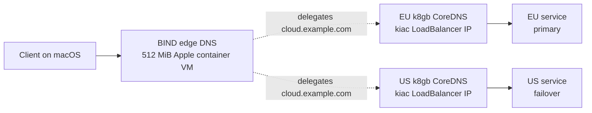

# k8gb multi-cluster DNS failover lab

[k8gb](https://www.k8gb.io/) is a Kubernetes operator for DNS-based global server load balancing. It watches application health in each cluster and publishes only healthy regional endpoints through authoritative DNS.

This is a good optional workload for kiac, but it does not belong in kiac core. A useful k8gb deployment needs at least two clusters, an authoritative parent DNS zone, and an explicit failover policy. The lab supplies all three without adding them to every kiac cluster.

## What the lab builds



The two application clusters are single-node k3s clusters with 3 GiB memory limits. Metrics and storage are disabled because this exercise does not use them. The edge DNS server is a standalone Apple container VM, so the lab uses three lightweight VMs instead of k8gb's stock three-cluster k3d topology.

The script pins k8gb `v0.20.0`, the arm64 BIND image manifest, and the demo nginx image manifest. It creates:

- `kiac-k8gb-eu` at context `kiac-k8gb-eu`
- `kiac-k8gb-us` at context `kiac-k8gb-us`
- `kiac-k8gb-edgedns`, serving `example.com` on port `1053`
- `demo.cloud.example.com`, with EU primary and US failover targets

## Prerequisites

```bash
brew install --cask saiyam1814/tap/kiac
brew install helm bind jq
kiac doctor
```

The fixed TSIG key and fake `example.com` zone are intentionally local-only. Never copy either into a real DNS environment.

## Start the lab

From a kiac checkout:

```bash
./examples/k8gb.sh up
```

The first run creates the clusters, installs the k8gb Helm chart in both, exposes each k8gb CoreDNS Service through `kiac-lb`, and deploys the regional demo Services. A successful final probe looks like:

```text
demo.cloud.example.com -> 192.168.64.x:8080 -> region=eu
```

The command is idempotent. Ownership markers under `~/.kiac/labs/k8gb` prevent it from adopting or deleting unrelated resources with the same names.

## Inspect the control plane

See the parent-zone delegation and current failover answer:

```bash
./examples/k8gb.sh verify
```

Inspect k8gb's view from both clusters:

```bash
kubectl --context kiac-k8gb-eu get gslb k8gb-demo -o yaml
kubectl --context kiac-k8gb-us get gslb k8gb-demo -o yaml
kubectl --context kiac-k8gb-eu -n k8gb get pods,svc
kubectl --context kiac-k8gb-us -n k8gb get pods,svc
```

The edge zone should delegate `cloud.example.com` to two generated nameservers. Their glue A records are the real kiac LoadBalancer addresses of the regional CoreDNS Services.

## Prove failover and failback

```bash
./examples/k8gb.sh failover
```

The drill performs three assertions:

1. DNS returns the healthy EU primary and HTTP responds with `region=eu`.
2. After the EU Deployment is scaled to zero, DNS moves to US and HTTP responds with `region=us`.
3. After EU is restored, DNS moves back to EU and HTTP again responds with `region=eu`.

The script checks real DNS answers and sends HTTP traffic to the returned address; it does not infer success from Kubernetes status alone. With the lab's 10-second TTL and 5-second reconciliation interval, each transition normally takes several seconds.

## Production mapping

Keep k8gb separate from kiac itself. In a real deployment:

- use two genuinely independent clusters or regions;
- delegate a subdomain you own to the regional k8gb nameservers;
- use a supported DNS provider such as Route53, Cloudflare, Azure DNS, Google Cloud DNS, or RFC2136 rather than the lab BIND VM;
- store provider credentials or TSIG material in a secret manager;
- choose TTLs based on failover time, resolver load, and provider minimums;
- monitor DNS reachability and k8gb reconciliation, because network partitions can produce intentionally conservative failover behavior.

k8gb is DNS failover, not a service mesh: existing connections are not moved, clients and recursive resolvers can cache records until TTL expiry, and health decisions depend on Kubernetes readiness.

## Troubleshooting

```bash
container logs kiac-k8gb-edgedns
kubectl --context kiac-k8gb-eu -n k8gb logs deployment/k8gb --tail=100
kubectl --context kiac-k8gb-us -n k8gb logs deployment/k8gb --tail=100
kubectl --context kiac-k8gb-eu -n k8gb logs deployment/k8gb-external-dns --tail=100
kubectl --context kiac-k8gb-us -n k8gb logs deployment/k8gb-external-dns --tail=100
```

If a run was interrupted, rerun `up`; owned stopped clusters are resumed and Helm/app resources are reconciled. The script preserves BIND zone data after cleanup for inspection.

## Clean up

```bash
./examples/k8gb.sh cleanup
```

Only resources with this lab's ownership marker are deleted. Existing kiac clusters are left alone.

For the upstream architecture and production provider guides, see the [k8gb documentation](https://www.k8gb.io/latest/) and its [local playground](https://www.k8gb.io/latest/local/).
