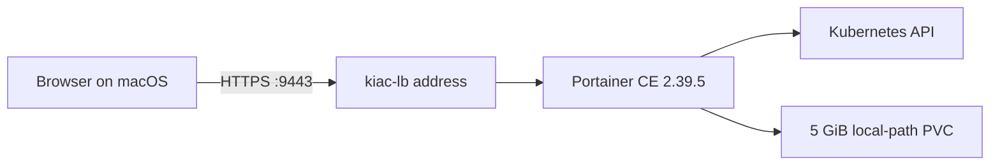

# Portainer CE lab

[Portainer](https://www.portainer.io/) is a web interface for managing containers and Kubernetes environments. This lab installs Portainer Community Edition inside a real kiac cluster and exposes it through kiac's built-in LoadBalancer.

Portainer is an optional workload, not a kiac addon. The lab keeps Portainer's cluster-admin access, persistent data, credentials, and lifecycle explicit instead of adding them to every cluster.

## What the lab builds



The script pins Portainer CE `2.39.5` LTS and Helm chart `239.5.0`. It creates a single-node Kubernetes `1.34` cluster because that version is in Portainer's validated Kubernetes range. The installation uses:

- a real `type: LoadBalancer` Service assigned by `kiac-lb`;
- a persistent volume from kiac's default StorageClass;
- Portainer's official cluster-admin service account for local management;
- a generated admin password stored mode `0600` under `~/.kiac/labs/portainer`;
- the self-signed HTTPS endpoint on port `9443`.

## Prerequisites

```bash
brew install --cask saiyam1814/tap/kiac
brew install helm jq
kiac doctor
```

Portainer CE does not require a license key. This lab never installs or enables Business Edition, which has a separate licensing flow. See Portainer's official [Community Edition install guide](https://docs.portainer.io/start/install-ce/server/kubernetes) and [Business Edition install guide](https://docs.portainer.io/start/install/server/kubernetes) for the distinction. The official images and chart support arm64.

## Start the lab

From a kiac checkout:

```bash
./examples/portainer.sh up
```

The first run creates `portainer-lab`, installs Portainer, waits for its Deployment and PVC, obtains the LoadBalancer IP, authenticates through the Portainer API, and registers the in-cluster Kubernetes environment. The current Portainer chart does not perform that final onboarding step automatically, so the lab makes it explicit and idempotent.

At the end it prints output similar to:

```text
Portainer API version: 2.39.5
managed environments: 1
Kubernetes nodes through Portainer: 1
UI: https://192.168.64.x:9443
username: admin
password file: /Users/you/.kiac/labs/portainer/portainer-lab/admin-password
```

The certificate is generated locally by Portainer, so the browser will show a self-signed certificate warning.

### Validation baseline

The complete workflow was rerun on August 14, 2026 with the released `kiac v0.5.0`: `up` created Kubernetes `1.34.8`, installed Portainer CE `2.39.5`, authenticated to the live API, found one healthy managed environment, and read one node through Portainer's Kubernetes API proxy. A separate `verify` run passed the same checks, and `cleanup` removed the cluster, kubeconfig context, and credential state.

## Verify it again

```bash
./examples/portainer.sh verify
```

This checks the actual user path rather than only reading Kubernetes status:

1. The Portainer Deployment is available.
2. Its persistent volume is `Bound`.
3. `kiac-lb` assigned a reachable address.
4. The HTTPS status endpoint reports the pinned Portainer version.
5. The generated admin credentials obtain a JWT.
6. The authenticated API lists the expected healthy local Kubernetes environment.
7. Portainer's Kubernetes API proxy returns the cluster's nodes.

Inspect the Kubernetes resources directly:

```bash
kubectl --context kiac-portainer-lab -n portainer get deploy,pod,svc,pvc
```

## Use an existing kiac cluster

The default is intentionally isolated so cleanup can delete the whole lab safely. To install into an existing ready cluster:

```bash
KIAC_PORTAINER_CLUSTER=dev \
KIAC_PORTAINER_USE_EXISTING=true \
./examples/portainer.sh up
```

The script refuses to adopt an existing `portainer` namespace or Helm release. Its ownership markers let cleanup remove only resources created by this lab, never the existing cluster.

To provide your own password without putting it in shell history:

```bash
PORTAINER_ADMIN_PASSWORD_FILE="$HOME/.config/portainer-lab-password" \
./examples/portainer.sh up
```

The password must contain at least 12 characters.

## Clean up

```bash
./examples/portainer.sh cleanup
```

For the default lab, this deletes the owned kiac cluster and its state directory. On an existing cluster, it removes only the owned Helm release and namespace, then deletes the local password copy.

## Scope and security

Portainer receives cluster-admin privileges because it manages the local Kubernetes environment. Use this lab only on a local development cluster, do not expose its LoadBalancer address beyond trusted networks, and use a trusted certificate plus external authentication for a shared deployment.

This lab demonstrates Kubernetes management. It does not turn apple/container into Docker Engine, add Docker Compose compatibility, or make Portainer manage the macOS host runtime.

See Portainer's [Kubernetes installation guide](https://docs.portainer.io/start/install-ce/server/kubernetes/baremetal) and [validated configurations](https://docs.portainer.io/start/requirements-and-prerequisites) for upstream details.
