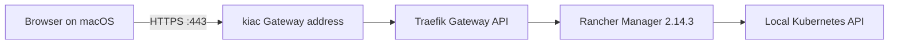

# Run Rancher on kiac

[Rancher Manager](https://github.com/rancher/rancher) is an open-source platform for managing Kubernetes clusters. This example installs Rancher as an optional application on a dedicated kiac cluster, exposes it through kiac's Gateway API, and verifies the real UI and authenticated API paths.

Rancher is not bundled with kiac and is not installed during normal cluster creation. The example keeps Rancher's resource cost, cluster-wide privileges, credentials, TLS, and lifecycle explicit.

## What the example installs



The script pins Rancher Manager and its Helm chart to `2.14.3`. It creates a single-node Kubernetes `1.34` cluster because that version is in Rancher `2.14.3`'s certified host-cluster range and below the chart's Kubernetes `1.36` ceiling. The installation uses:

- kiac's existing Gateway API and Traefik addon;
- an HTTPS hostname derived from the Gateway LoadBalancer IP with `sslip.io`;
- a one-year, locally generated self-signed certificate stored mode `0600`;
- a generated bootstrap password stored mode `0600` under `~/.kiac/labs/rancher`;
- one Rancher replica for a small local development footprint;
- a dedicated cluster that can be removed cleanly as one unit.

The supplied TLS secret means the example does not install cert-manager. Normal kiac clusters receive no Rancher components and pay no startup or idle resource cost.

## Prerequisites

```bash
brew install --cask saiyam1814/tap/kiac
brew install helm jq
kiac doctor
```

Rancher `2.14.3` requires Helm `3.18` or newer; Helm 4 also works. The script also checks for `container`, `kubectl`, `curl`, and `openssl`.

This example uses the open-source Rancher Manager distribution and does not require a license key. SUSE Rancher Prime is the separately subscribed support and enterprise offering. Rancher's official repository is [Apache-2.0 licensed](https://github.com/rancher/rancher/blob/release/v2.14/LICENSE).

## Install Rancher on kiac

From a kiac checkout:

```bash
./examples/rancher.sh up
```

The first run creates a dedicated cluster named `rancher-lab` with four CPUs, 6 GiB of memory, Kubernetes `1.34`, and `--gateway`. It then generates the password and certificate, installs the pinned stable chart, waits for Rancher and its Gateway, signs in through Rancher's API, and waits for the local cluster to become active.

A successful run ends with output similar to:

```text
Rancher API version: v2.14.3
local cluster state: active
Kubernetes nodes through Rancher: 1
Gateway IP: 192.168.64.x
UI: https://rancher.192.168.64.x.sslip.io
username: admin
password file: /Users/you/.kiac/labs/rancher/rancher-lab/bootstrap-password
```

The browser will warn about the self-signed certificate. That is expected for this isolated local example. Use a trusted certificate and a hostname you control for a shared installation.

### Validation baseline

The complete workflow was run on August 14, 2026 with the released `kiac v0.5.0`: `up` created Kubernetes `1.34.8`, installed Rancher Manager `v2.14.3`, served the dashboard through an accepted Gateway and HTTPRoutes, obtained an admin API token, reported the local cluster active, and returned its node through the Rancher API. A separate `verify` run passed the same checks, an idempotent second `up` preserved the credential and certificate, and `cleanup` removed the VM, kubeconfig context, and generated state.

## Verify it again

```bash
./examples/rancher.sh verify
```

This checks the actual user path rather than stopping at Kubernetes readiness:

1. The Rancher Deployment is available.
2. The Rancher Gateway is `Programmed`.
3. The HTTPS and HTTP-redirect routes are accepted with resolved references.
4. `/ping` returns `pong` through Traefik and the Gateway LoadBalancer IP.
5. `/dashboard/` returns Rancher's real application HTML.
6. The generated admin credential obtains a Rancher API token.
7. The authenticated API reports the pinned Rancher version.
8. Rancher's local cluster is `active` and its node is visible through the API.

The verifier uses `curl --resolve` internally. Its network checks therefore do not depend on `sslip.io` DNS working through a corporate VPN, although a browser still needs to resolve the displayed hostname.

Inspect the Kubernetes resources directly:

```bash
kubectl --context kiac-rancher-lab -n cattle-system \
  get deploy,pod,svc,gateway,httproute
```

## Choose a cluster name or hostname

Use another dedicated cluster name:

```bash
KIAC_RANCHER_CLUSTER=management \
./examples/rancher.sh up
```

Use a DNS name that already points to the kiac Gateway address:

```bash
KIAC_RANCHER_HOSTNAME=rancher.dev.example.com \
./examples/rancher.sh up
```

To provide your own bootstrap password without putting it in shell history:

```bash
RANCHER_BOOTSTRAP_PASSWORD_FILE="$HOME/.config/rancher-lab-password" \
./examples/rancher.sh up
```

The password must contain at least 12 characters.

## Why a dedicated cluster

Rancher is a cluster manager, not a small namespaced dashboard. It creates cluster roles, custom resources, controllers, webhooks, and system namespaces as part of managing its local cluster. Uninstalling a Helm release is therefore not equivalent to removing every object Rancher owns.

The example refuses to adopt an unrelated existing cluster. This gives `cleanup` a clear ownership boundary and makes the result reproducible. Rancher can import other kiac clusters from its UI after installation, but that is outside this local installation example.

## Clean up

```bash
./examples/rancher.sh cleanup
```

This deletes only the kiac cluster carrying the script's ownership marker, removes its kubeconfig context, and deletes the local credential and certificate state. If the marker is absent, the script leaves the cluster alone.

## Scope and security

Rancher has broad privileges because it manages Kubernetes. Keep the Gateway address on a trusted local network, do not commit or share the generated credential, and do not treat the self-signed certificate or single-replica deployment as a production design.

This example demonstrates Rancher managing Kubernetes on kiac. It does not add Rancher to the kiac binary, replace kiac's own dashboard, or change apple/container into a Docker Engine or Docker Compose runtime.

See Rancher's official [Kubernetes installation guide](https://ranchermanager.docs.rancher.com/getting-started/installation-and-upgrade/install-upgrade-on-a-kubernetes-cluster), [version documentation](https://ranchermanager.docs.rancher.com/versions), and [support matrix](https://www.suse.com/suse-rancher/support-matrix/all-supported-versions/) for upstream details.
